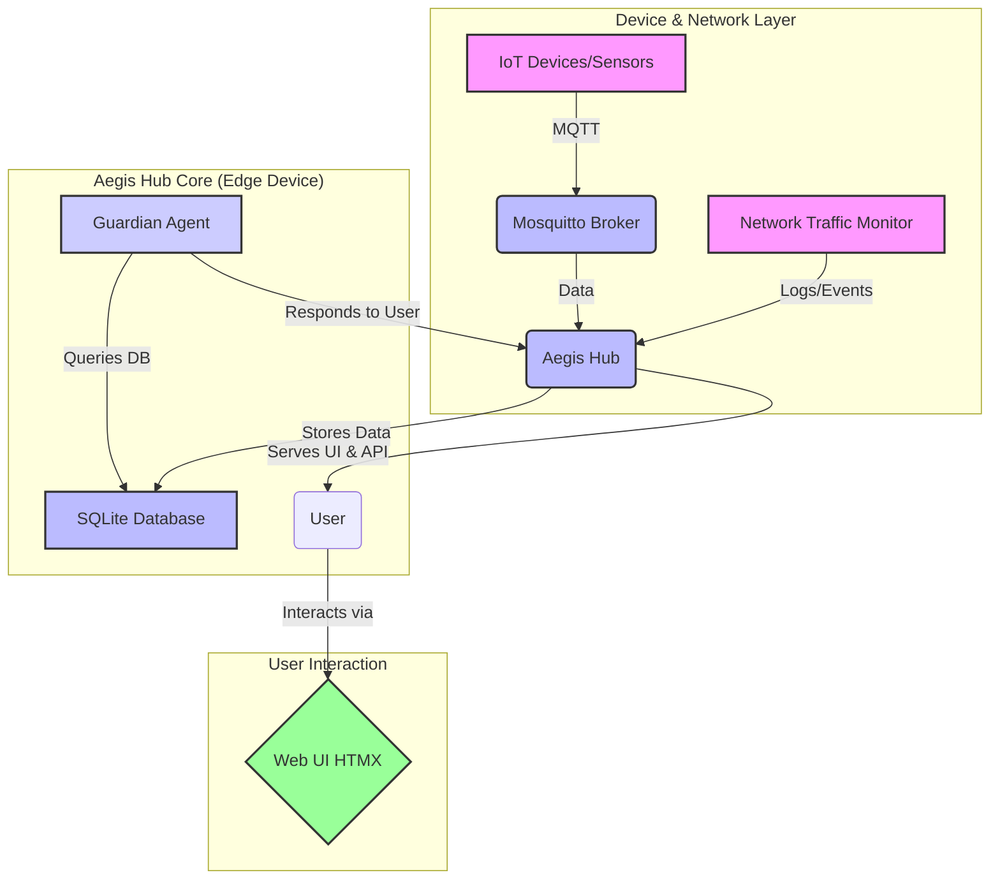

# Aegis Hub: The Agentic Digital Guardian

**Aegis Hub** is a next-generation, AI-powered digital guardian for your smart home or experimental lab. It functions as an intelligent, agentic firewall that monitors network traffic and device behavior in real-time. By combining a robust data ingestion pipeline with a conversational AI agent, Aegis Hub provides both proactive protection and intuitive, interactive control over your local network.

Users can "talk" to the system to investigate anomalies, query device status, or understand network events, receiving generated responses and alerts from their personal AI guardian.

## Core Concept

In a modern smart home, countless devices connect to the network. Aegis Hub is designed to be the central nervous system for this environment. It operates on three core principles:

1.  **Observe:** Ingests data from all connected devices and network streams via MQTT and other monitoring services. All data is stored locally in a private SQLite database.
2.  **Reason:** An onboard AI agent, equipped with specialized tools, continuously analyzes the data to understand baseline behaviors and identify anomalies, threats, or system failures.
3.  **Interact:** Provides a simple, powerful interface (FastAPI + HTMX) where you can chat with the agent to get insights, receive alerts, and manage your smart home environment.

## Features

-   **Unified Data Ingestion:** Centralizes data from IoT devices, sensors, and network traffic using an integrated MQTT broker.
-   **Local-First & Private:** All data is stored and processed on your local network in a private SQLite database. No cloud dependency for core functionality.
-   **Agentic AI Core:** A Google ADK-based agent acts as the system's brain, capable of reasoning about the state of your home.
-   **Interactive Chat Interface:** Use a simple, web-based chat UI (built with FastAPI and HTMX) to query the agent. Ask questions like:
    -   *"Are there any new devices on the network today?"*
    -   *"Show me the activity for the living room camera in the last hour."*
    -   *"Why is the smart plug using so much data?"*
-   **Real-Time Anomaly Detection:** The agent proactively monitors for unusual patterns (e.g., a device connecting to an unknown server, a sudden spike in data usage) and alerts you.
-   **Lightweight & Containerized:** All services (FastAPI Hub, AI Agent, MQTT Broker) are orchestrated with Docker Compose for easy deployment on a Raspberry Pi or a home NAS.
-   **Server-Sent Events (SSE):** Pushes real-time alerts and updates to the UI without needing a full page refresh.

## System Architecture

The system is composed of several microservices that work together, orchestrated by Docker.



## Technology Stack

-   **Backend & API:** FastAPI
-   **Frontend:** HTMX, Server-Sent Events (SSE)
-   **Database:** SQLite
-   **AI Agent:** Google Agent Development Kit (ADK)
-   **Messaging:** Mosquitto MQTT Broker
-   **Containerization:** Docker & Docker Compose
-   **Core Language:** Python 3.11+

## Folder Structure

```
/aegis-hub/
├── .gitignore
├── docker-compose.yml         # Orchestrates all services
├── README.md                  # This file
│
├── config/
│   └── guardian_config.yaml   # Central config for all services
│
├── data/
│   └── guardian.db            # (Git ignored) SQLite database
│
├── scripts/
│   ├── start.sh               # Start all services
│   └── stop.sh                # Stop all services
│
└── src/
    ├── agent/
    │   ├── run_agent.py       # Main entrypoint for the ADK agent
    │   ├── system_prompt.txt  # Defines the agent's persona and mission
    │   └── tools/
    │       └── hub_tools.py   # Tools to query the database
    │
    ├── hub/
    │   ├── main.py            # FastAPI app for data ingestion
    │   ├── database.py        # Manages SQLite connection and schema
    │   └── mqtt_client.py     # Handles MQTT subscriptions
    │
    └── ui/
        ├── main.py            # FastAPI app to serve the UI
        └── templates/
            ├── index.html     # Main page layout
            └── partials/      # Directory for HTMX fragments
```

## Getting Started

### Prerequisites

-   A host machine capable of running Docker (e.g., Raspberry Pi 4/5, a NAS, or any Linux server).
-   Docker and Docker Compose installed.
-   Git for cloning the repository.

### Installation

1.  **Clone the repository:**
    ```bash
    git clone <your-repo-url>
    cd aegis-hub
    ```

2.  **Configure the Hub:**
    Review and edit `config/guardian_config.yaml` if you need to change default settings like MQTT topics or database paths.

3.  **Build and Start the Services:**
    Use the provided helper script to launch the entire system.
    ```bash
    chmod +x scripts/start.sh
    ./scripts/start.sh
    ```
    This command will build the Docker images and start the `aegis-hub`, `guardian-agent`, and `mosquitto` services in the background.

### Interacting with the Guardian

Once the system is running, open your web browser and navigate to `http://<your-host-ip>:8000`.

You will be greeted with the Aegis Hub dashboard, which features:
-   **A Chat Window:** To talk to the Guardian Agent.
-   **An Alerts Panel:** Where real-time notifications will appear.

## Future Roadmap

-   [ ] **Knowledge Graph Integration:** Transition from relational SQLite queries to a knowledge graph for more complex reasoning and relationship discovery.
-   [ ] **Cloud Sync (Optional):** Implement an optional, secure sync mechanism to back up critical data or embeddings to a cloud object store (e.g., Cloudflare R2, AWS S3).
-   [ ] **Advanced Network Analysis:** Integrate tools like `tshark` or `Suricata` for deeper packet inspection and more sophisticated threat detection.
-   [ ] **Device Control:** Grant the agent the ability to take action, such as blocking a suspicious device at the network level or power-cycling a malfunctioning sensor.
-   [ ] **Historical Analysis Dashboard:** Add a dedicated page for visualizing historical trends, device behavior, and network statistics over time.
