# Aegis Hub: The Agentic Digital Guardian

**Aegis Hub** is a next-generation, AI-powered digital guardian for your smart home or experimental lab. It functions as an intelligent, agentic firewall that monitors network traffic and device behavior in real-time. By combining a robust data ingestion pipeline with a conversational AI agent, Aegis Hub provides both proactive protection and intuitive, interactive control over your local network.

The agent's intelligence is modeled after the **CAMA (Cognitive Architecture for Monitoring Agent)** framework, allowing it to perceive, reason about, and learn from the events in its environment.

## Core Concept: The CAMA Cognitive Core

Aegis Hub's "sentience" is not just a concept; it's a structured cognitive process. The Guardian Agent uses the CAMA framework to transform raw, noisy data into actionable insights. This process is a continuous loop of **Refactor, Break Down, and Compile**.

1.  **Refactor (Perception & Enrichment):** The agent ingests raw data (e.g., network logs) and uses its **Semantic Memory** (a knowledge base of facts about devices, protocols, and known IPs) to enrich it into a meaningful format. A MAC address becomes "Living Room Camera," and an IP address becomes "Google DNS."

2.  **Break Down (Analysis & Investigation):** Using its **Procedural Memory** (a skillset of analysis tools) and **Working Memory** (short-term context), the agent investigates the enriched data. It asks questions like: "Is this data volume normal for this device?" or "Is this a known, safe destination?"

3.  **Compile (Conclusion & Learning):** The agent synthesizes its findings into a coherent conclusion. This conclusion is then stored in its **Episodic Memory** (a long-term log of all significant events and incidents), allowing it to learn from past experiences.

4.  **Output (Actionable Insight):** The final, human-readable conclusion is pushed to the user as a real-time alert or provided as a response to a query.

## Features

-   **Structured AI Thinking:** Implements the CAMA cognitive architecture for transparent and powerful reasoning.
-   **Four-Part Memory System:** Utilizes Semantic, Procedural, Working, and Episodic memory for robust, context-aware analysis.
-   **Unified Data Ingestion:** Centralizes data from IoT devices and network traffic via an integrated MQTT broker.
-   **Local-First & Private:** All data, including the agent's memories, is stored locally in a private SQLite database.
-   **Interactive Chat Interface:** Use a simple, web-based UI (FastAPI + HTMX) to query the agent's understanding of your home network.
-   **Proactive Anomaly Detection:** The agent's cognitive loop allows it to identify and alert on suspicious activities without being explicitly programmed for them.
-   **Containerized & Lightweight:** All services are orchestrated with Docker Compose for easy deployment on a Raspberry Pi or home NAS.

## System Architecture

The system's architecture is designed around the agent's cognitive loop, ensuring a clear data flow from raw input to intelligent output.

```mermaid
graph TD
    subgraph DataLayer ["🔌 Data & Device Layer"]
        IoT["📡 IoT Devices &<br/>Network Traffic"] -- "Raw Data" --> Mosquitto["📨 Mosquitto MQTT Broker"]
    end
    
    subgraph AegisCore ["🛡️ Aegis Hub Core"]
        direction TB
        
        subgraph GuardianAgent ["🤖 Guardian Agent"]
            direction TB

            subgraph GoogleADK ["🧠 Google ADK (Runtime & Tool Executor)"]
                ADKRuntime["🔧 ADK Runtime Engine"]
            end

            subgraph CAMA ["🔄 CAMA Cognitive Core"]
                direction LR
                Input["📥 Input"] --> Refactor["Refactor"]
                Refactor --> Breakdown["Breakdown"]
                Breakdown --> Compile["Compile"]
                Compile --> Output["📤 Insight"]
            end
            
            subgraph MemorySystems ["🧠 Memory Systems"]
                direction TB
                SM["📚 Semantic"]
                WM["⚡ Working"]
                PM["🛠️ Procedural<br/>(Implemented as ADK Tools)"]
                EM["📋 Episodic"]
            end

            ADKRuntime -- "Executes" --> CAMA
            ADKRuntime -- "Manages & Calls" --> PM
            
            Refactor -- "Uses" --> SM
            Breakdown -- "Uses" --> WM
            Breakdown -- "Calls Tools from" --> PM
            Compile -- "Updates" --> EM
        end

        subgraph Services ["⚙️ Services & Storage"]
            FastAPI["🚀 FastAPI Server"]
            SQLite["🗄️ SQLite Database"]
            HTMX["🌐 HTMX UI"]
        end

        Mosquitto --> FastAPI --> SQLite --> Input
        Output --> FastAPI --> HTMX
    end
    
    subgraph UserLayer ["👥 User Interaction"]
        User["👤 Analyst / User"]
        HTMX <--> User
    end

    classDef dataLayer fill:#e1f5fe,stroke:#0277bd,stroke-width:2px
    classDef adkLayer fill:#fce4ec,stroke:#c2185b,stroke-width:2px
    classDef camaLayer fill:#e3f2fd,stroke:#1976d2,stroke-width:2px
    classDef memorySystem fill:#fff3e0,stroke:#ef6c00,stroke-width:2px
    classDef serviceLayer fill:#f3e5f5,stroke:#7b1fa2,stroke-width:2px
    classDef userLayer fill:#fff8e1,stroke:#f57c00,stroke-width:2px

    class IoT,Mosquitto dataLayer
    class ADKRuntime adkLayer
    class Input,Refactor,Breakdown,Compile,Output camaLayer
    class SM,WM,PM,EM memorySystem
    class FastAPI,SQLite,HTMX serviceLayer
    class User userLayer
```




## Technology Stack

-   **Backend & API:** FastAPI
-   **Frontend:** HTMX, Server-Sent Events (SSE)
-   **Database:** SQLite
-   **AI Agent:** Google Agent Development Kit (ADK) with a CAMA-based cognitive loop.
-   **Messaging:** Mosquitto MQTT Broker
-   **Containerization:** Docker & Docker Compose
-   **Core Language:** Python 3.11+

## Folder Structure

```
/aegis-hub/
├── .gitignore
├── docker-compose.yml
├── README.md
│
├── config/
│   └── guardian_config.yaml
│
├── data/
│   └── guardian.db
│
├── scripts/
│   ├── start.sh
│   └── stop.sh
│
└── src/
    ├── agent/
    │   ├── run_agent.py         # Main entrypoint, runs the CAMA loop
    │   ├── cognitive_core.py    # Implements Refactor, Break Down, Compile
    │   ├── memory_systems.py    # Defines the four memory types
    │   └── tools/
    │       └── analysis_tools.py # The agent's Procedural Memory (skills)
    │
    ├── hub/
    │   ├── main.py              # FastAPI app for data ingestion
    │   ├── database.py          # Manages SQLite connection
    │   └── mqtt_client.py       # Handles MQTT subscriptions
    │
    └── ui/
        ├── main.py              # FastAPI app to serve the UI
        └── templates/
            ├── index.html
            └── partials/
```

## Getting Started

### Prerequisites

-   A host machine capable of running Docker (e.g., Raspberry Pi 4/5, a NAS, or any Linux server).
-   Docker and Docker Compose installed.
-   Git for cloning the repository.

### Installation

1.  **Clone the repository:**
    ```bash
    git clone <your-repo-url>
    cd aegis-hub
    ```

2.  **Configure the Hub:**
    Review and edit `config/guardian_config.yaml` if you need to change default settings.

3.  **Build and Start the Services:**
    ```bash
    chmod +x scripts/start.sh
    ./scripts/start.sh
    ```

### Interacting with the Guardian

Once the system is running, open your web browser and navigate to `http://<your-host-ip>:8000`.

## Future Roadmap

-   [ ] **Knowledge Graph Memory:** Evolve the Semantic Memory from simple tables into a true knowledge graph for more complex relationship discovery.
-   [ ] **Advanced Network Analysis:** Integrate tools like `tshark` or `Suricata` to provide richer input to the CAMA process.
-   [ ] **Agent-Driven Actions:** Grant the agent the ability to take action based on its conclusions, such as blocking a suspicious device.
