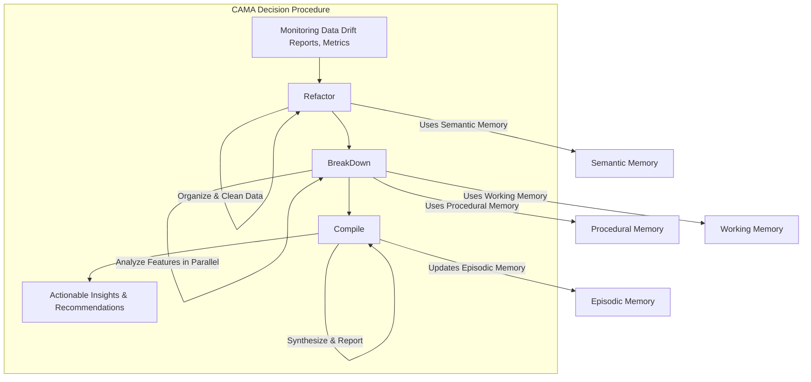

**Explanation:** This diagram illustrates the core decision-making process of CAMA (Cognitive Architecture for Monitoring Agent). It shows the flow from raw monitoring data through the three key steps: Refactor, Break Down, and Compile, ultimately leading to actionable insights. It also highlights how CAMA leverages its different memory modules (Semantic, Procedural, Working, and Episodic) throughout this process.